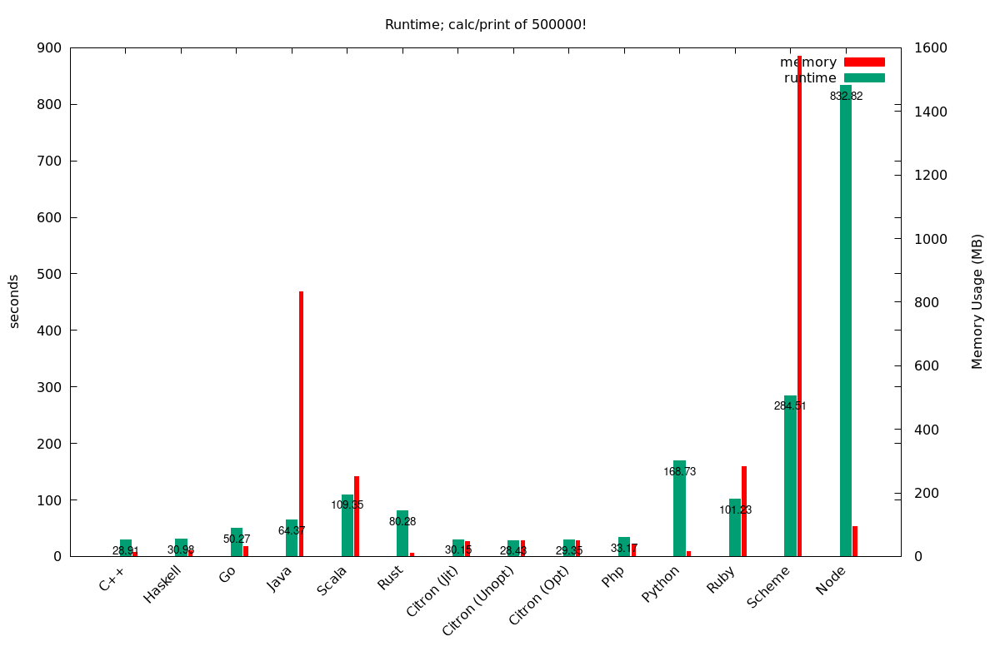

# Silly Comparison of a silly concept in different languages

+ _A plot_


## Running it
```sh
$ make all #-> cleans, builds and runs all the tests, and generates a plot (node.js will take a long time)
$ make quick #-> everything but node
```
**Note: zsh's `time` is used for timing, and the format is as follows**
```
%J   %U  user %S system %P cpu %*E total'$'\n'
```

### Think my code is junk, or unfairly slow?
 Fix it yourself
