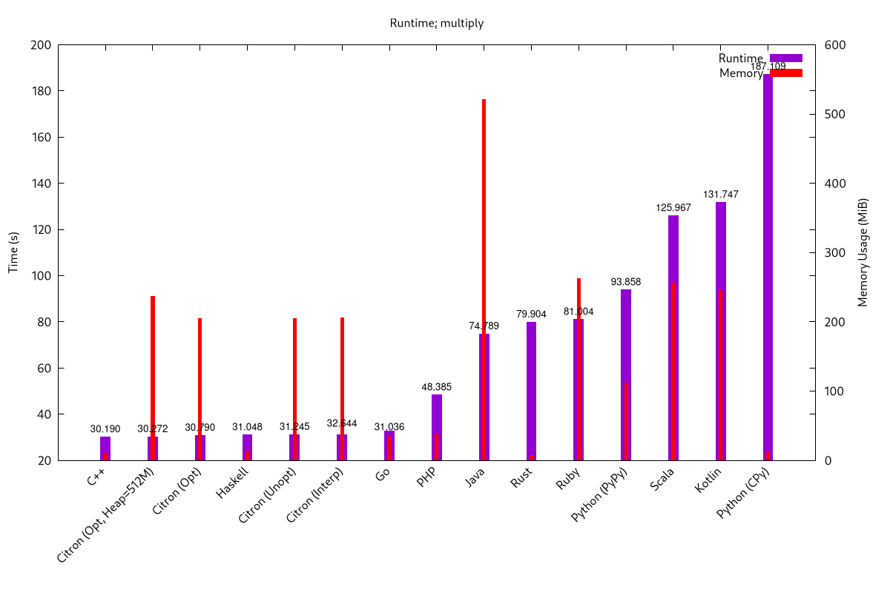

# Silly Comparison of a silly concept in different languages

+ _A plot_ (Multiply: calc/print of 500000!)

Note that these aren't necessarily representative of the languages used, but rather what _I_ could write in them without spending too long thinking about it.

## Running it
To run all defined benchmarks, just run `python run.py`, which will dump the plot into `plots/`, and the results into `data.dat` and `memories`.

To skip some specific benchmarks, define the env vars `BENCH_OVERRIDE=SKIP` and `BENCH_<language>=TRUE` (or `BENCH_<mode>=TRUE` to skip a specific mode)

And to run only some specific benchmarks, set `BENCH_OVERRIDE=RUN` instead of `SKIP`.

To run N benchmarks in parallel, set `BENCH_JOB=N`, or to anything that's not a number to make it use all CPUs (as defined by `os.cpu_count()`).

### Think my code is junk, or unfairly slow?
 Fix it yourself (and throw me a PR)
