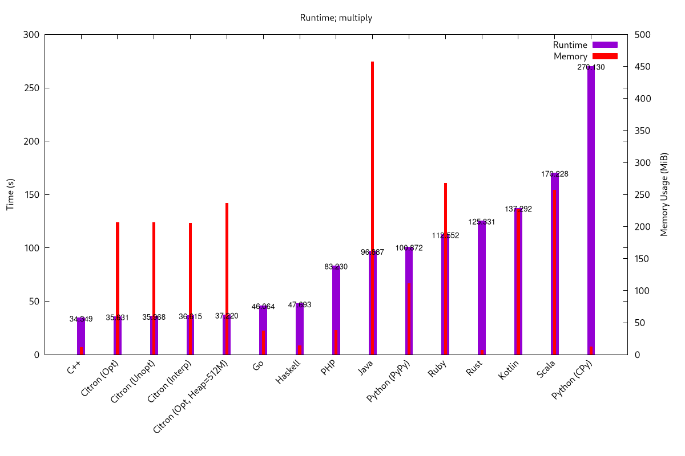

# Silly Comparison of a silly concept in different languages

+ _A plot_ (Multiply: calc/print of 500000!)

## Running it
To run all defined benchmarks, just run `python run.py`, which will dump the plot into `plots/`, and the results into `data.dat` and `memories`.

To skip some specific benchmarks, define the env vars `BENCH_OVERRIDE=SKIP` and `BENCH_<language>=TRUE` (or `BENCH_<mode>=TRUE` to skip a specific mode)

And to run only some specific benchmarks, set `BENCH_OVERRIDE=RUN` instead of `SKIP`.

### Think my code is junk, or unfairly slow?
 Fix it yourself (and throw me a PR)
